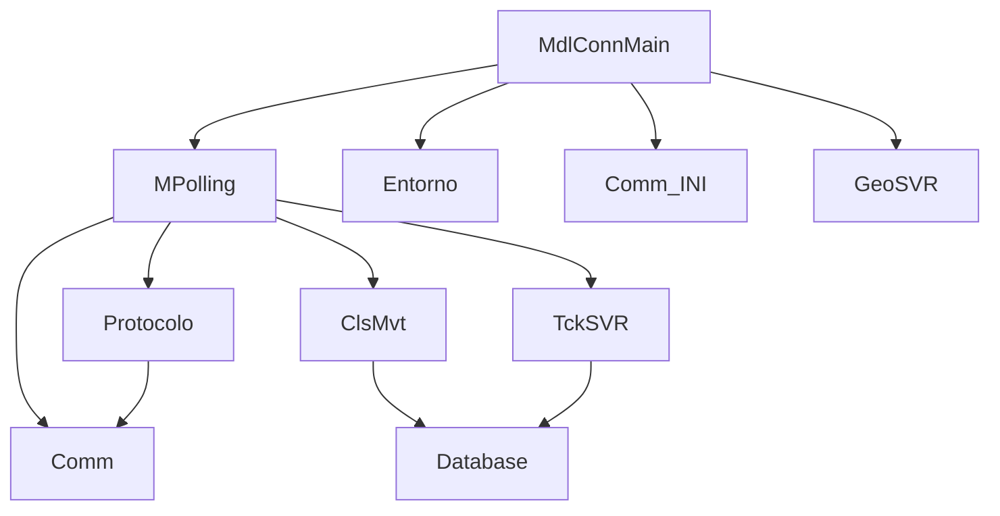

# Documentación Técnica - Proyecto WPC
## Migración de Visual Basic 6 a Python

### 1. DESCRIPCIÓN GENERAL DEL SISTEMA

**WPC (Windows Park Control)** es un sistema de control de acceso vehicular y peatonal que gestiona módulos de hardware mediante comunicación serie RS485. El sistema maneja:

- Control de barreras, molinetes y puertas
- Lectura de tarjetas de proximidad y códigos de barras
- Gestión de tickets de estacionamiento
- Integración con cámaras GeoVision
- Base de datos SQL Server para registro de movimientos
- Comunicación con placas controladoras ST1660, VME100, Cash Park

### 10. CONFIGURACIÓN HIKVISION RECOMENDADA

#### 10.1 Tipos de Dispositivos Soportados
```python
# Configuración para diferentes tipos de dispositivos Hikvision
HIKVISION_DEVICE_TYPES = {
    'nvr': {
        'api_base': '/ISAPI',
        'snapshot_path': '/Streaming/channels/{channel}01/picture',
        'rtsp_path': '/Streaming/Channels/{channel}01',
        'max_channels': 32
    },
    'dvr': {
        'api_base': '/ISAPI',
        'snapshot_path': '/Streaming/channels/{channel}01/picture',
        'rtsp_path': '/Streaming/Channels/{channel}01',
        'max_channels': 16
    },
    'camera': {
        'api_base': '/ISAPI',
        'snapshot_path': '/Streaming/channels/101/picture',
        'rtsp_path': '/Streaming/Channels/101',
        'max_channels': 1
    }
}
```

#### 10.2 Configuración de Cámaras por Módulo
```python
# Equivalente a la tabla mdlcam en BD
camera_module_mapping = {
    'module_1': {
        'device_id': 'nvr_entrance',
        'channel': 1,
        'description': 'Entrada Principal'
    },
    'module_2': {
        'device_id': 'nvr_entrance', 
        'channel': 2,
        'description': 'Salida Principal'
    }
}
```

#### 10.3 Ventajas de Hikvision sobre GeoVision
1. **API REST Estándar**: Más fácil de integrar que controles ActiveX
2. **Soporte RTSP**: Streaming estándar compatible con OpenCV
3. **Mayor Resolución**: Soporte 4K y configuraciones avanzadas
4. **Mejor Seguridad**: Autenticación digest y HTTPS
5. **Escalabilidad**: Un NVR puede manejar múltiples cámaras
6. **Cloud Ready**: APIs compatibles con servicios cloud

#### 10.4 Migración de Funcionalidades GeoVision
```python
# ANTES (GeoVision VB6):
# CACommMain.Mi_LiveX(index).SnapShotToFile(filename)

# DESPUÉS (Hikvision Python):
class ModernCameraIntegration:
    def __init__(self):
        self.hikvision = HikvisionCameraManager()
        
    def setup_cameras_for_modules(self, modules_config):
        """Configurar cámaras según módulos activos"""
        for module in modules_config:
            if module.has_camera:
                self.hikvision.add_device(
                    module.camera_id,
                    module.camera_ip,
                    module.camera_user,
                    module.camera_pass,
                    module.camera_type
                )
                
    def capture_movement_photo(self, module_id: int, movement_id: str):
        """Capturar foto automática en movimiento"""
        timestamp = datetime.now().strftime("%Y%m%d_%H%M%S")
        filename = f"movements/{movement_id}_{timestamp}.jpg"
        
        camera_config = self.get_camera_for_module(module_id)
        if camera_config:
            return self.hikvision.capture_image(
                camera_config['device_id'],
                camera_config['channel'],
                filename
            )
        return False
```

### 11. ESQUEMA DE BASE DE DATOS SQL SERVER

#### 11.1 Tablas Principales Identificadas
```sql
-- Tabla de Movimientos
CREATE TABLE mvt (
    MovimientoID BIGINT PRIMARY KEY,
    ModuloID INT NOT NULL,
    IdentificacionID BIGINT NOT NULL,
    FechaHora DATETIME NOT NULL
);

-- Tabla de Tickets Activos
CREATE TABLE tck (
    TicketID BIGINT PRIMARY KEY,
    Numero BIGINT NOT NULL,
    FechaHoraIngreso DATETIME NOT NULL,
    ModuloIngresoID INT NOT NULL,
    validado BIT DEFAULT 0
);

-- Tabla de Historial de Tickets
CREATE TABLE tckhst (
    TicketID BIGINT PRIMARY KEY,
    Numero BIGINT NOT NULL,
    FechaHoraIngreso DATETIME NOT NULL,
    ModuloIngresoID INT NOT NULL,
    FechaHoraSalida DATETIME NOT NULL,
    ModuloSalidaID INT NOT NULL
);

-- Tabla de Personas
CREATE TABLE per (
    PersonaID BIGINT PRIMARY KEY,
    Apellido NVARCHAR(100),
    Nombre NVARCHAR(100),
    Sexo NCHAR(1),
    FechaNacimiento DATE,
    Pais NVARCHAR(50),
    CreationDate DATETIME,
    CREATEdByID INT,
    LastUpdateDate DATETIME,
    LastUpdateDateByID INT,
    FechaInicio DATETIME,
    FechaFin DATETIME
);

-- Tabla de Identificaciones
CREATE TABLE idn (
    IdentificacionID BIGINT PRIMARY KEY,
    Numero NVARCHAR(20) NOT NULL
);

-- Tabla de Módulos
CREATE TABLE mdl (
    ModuloID INT PRIMARY KEY,
    Address INT NOT NULL,
    Nombre NVARCHAR(100),
    GrupoModulos INT,
    OrdenEncuesta INT,
    ModuloEntradaID INT,
    ModuloSalidaID INT,
    duracion_pulso INT DEFAULT 0,
    ValidacionTicket BIT DEFAULT 0
);
```

#### 11.2 Modelos SQLAlchemy para Python
```python
from sqlalchemy import Column, Integer, BigInteger, String, DateTime, Boolean, ForeignKey
from sqlalchemy.ext.declarative import declarative_base
from sqlalchemy.orm import relationship
from datetime import datetime

Base = declarative_base()

class Movement(Base):
    __tablename__ = 'mvt'
    
    MovimientoID = Column(BigInteger, primary_key=True)
    ModuloID = Column(Integer, nullable=False)
    IdentificacionID = Column(BigInteger, nullable=False)
    FechaHora = Column(DateTime, nullable=False, default=datetime.now)
    
class Ticket(Base):
    __tablename__ = 'tck'
    
    TicketID = Column(BigInteger, primary_key=True)
    Numero = Column(BigInteger, nullable=False)
    FechaHoraIngreso = Column(DateTime, nullable=False)
    ModuloIngresoID = Column(Integer, nullable=False)
    validado = Column(Boolean, default=False)
    
class TicketHistory(Base):
    __tablename__ = 'tckhst'
    
    TicketID = Column(BigInteger, primary_key=True)
    Numero = Column(BigInteger, nullable=False)
    FechaHoraIngreso = Column(DateTime, nullable=False)
    ModuloIngresoID = Column(Integer, nullable=False)
    FechaHoraSalida = Column(DateTime, nullable=False)
    ModuloSalidaID = Column(Integer, nullable=False)

class Person(Base):
    __tablename__ = 'per'
    
    PersonaID = Column(BigInteger, primary_key=True)
    Apellido = Column(String(100))
    Nombre = Column(String(100))
    Sexo = Column(String(1))
    FechaNacimiento = Column(DateTime)
    FechaInicio = Column(DateTime)
    FechaFin = Column(DateTime)
    CreationDate = Column(DateTime, default=datetime.now)

class Identification(Base):
    __tablename__ = 'idn'
    
    IdentificacionID = Column(BigInteger, primary_key=True)
    Numero = Column(String(20), nullable=False)

class Module(Base):
    __tablename__ = 'mdl'
    
    ModuloID = Column(Integer, primary_key=True)
    Address = Column(Integer, nullable=False)
    Nombre = Column(String(100))
    GrupoModulos = Column(Integer)
    OrdenEncuesta = Column(Integer)
    ModuloEntradaID = Column(Integer)
    ModuloSalidaID = Column(Integer)
    duracion_pulso = Column(Integer, default=0)
    ValidacionTicket = Column(Boolean, default=False)
```

#### 11.3 Gestión de IDs Únicos
El sistema VB6 usa una función personalizada para generar IDs:
```python
from datetime import datetime
import time

class IDGenerator:
    @staticmethod
    def generate_movement_id() -> int:
        """
        Equivalente a new_id_mvt en VB6
        Genera ID basado en días desde 2007/06/01 + milisegundos del día
        """
        base_date = datetime(2007, 6, 1)
        current_date = datetime.now()
        
        days_diff = (current_date.date() - base_date.date()).days
        
        # Milisegundos del día actual
        milliseconds_today = (
            current_date.hour * 3600000 +
            current_date.minute * 60000 +
            current_date.second * 1000 +
            current_date.microsecond // 1000
        )
        
        return days_diff * 100000000 + milliseconds_today
```

---

### 2. ARQUITECTURA DEL SISTEMA

```
┌─────────────────────────────────────────────────────────┐
│                    APLICACIÓN WPC                       │
├─────────────────────────────────────────────────────────┤
│  Formularios (UI)  │  Módulos (Logic)  │  Clases (Data) │
├─────────────────────────────────────────────────────────┤
│                 Comunicación Serie RS485                │
├─────────────────────────────────────────────────────────┤
│              Base de Datos Microsoft SQL Server         │
├─────────────────────────────────────────────────────────┤
│                Hardware (Placas Controladoras)          │
└─────────────────────────────────────────────────────────┘
```

---

### 3. ANÁLISIS DETALLADO POR COMPONENTES

## 3.1 FORMULARIOS (UI Layer)

### 3.1.1 CACommMain.frm (Formulario Principal)
**Funcionalidad:**
- Interfaz principal del sistema
- Monitoreo visual del estado de módulos
- Control manual de dispositivos (barreras, puertas)
- Visualización de LEDs de comunicación
- Gestión de eventos de usuario

**Componentes Clave:**
- Timers para polling de módulos
- Imágenes que reflejan estado (barrera alta/baja, sensores DDMM)
- Controles de comunicación serie (MSComm)
- Integración con cámaras GeoVision (LiveX)

**Migración a Python:**
```python
# Estructura sugerida
class MainWindow(QMainWindow):
    def __init__(self):
        self.communication_manager = CommunicationManager()
        self.module_manager = ModuleManager()
        self.camera_manager = CameraManager()
        self.setup_ui()
        self.setup_timers()
```

### 3.1.2 ViewComm.frm (Visualizador de Comunicación)
**Funcionalidad:**
- Debug de comunicación serie
- Monitoreo de comandos TX/RX
- Log en tiempo real

**Migración a Python:**
```python
class CommunicationDebugWindow(QDialog):
    def update_view(self, message: str):
        # Equivalent to UpdateView method
        pass
```

### 3.1.3 FrmImg.frm (Visualización de Imágenes)
**Funcionalidad:**
- Muestra fotos de personas en eventos de acceso
- Redimensionamiento dinámico
- Información de movimientos

**Migración a Python:**
```python
class ImageDisplayWindow(QWidget):
    def __init__(self, window_type: int):
        self.window_type = window_type
        self.setup_ui()
```

## 3.2 MÓDULOS (Business Logic)

### 3.2.1 MdlConnMain.bas (Módulo Principal)
**Funcionalidad:**
- Punto de entrada de la aplicación
- Inicialización de componentes
- Gestión de configuración y entorno
- Control de ciclo de vida de la aplicación

**Dependencias:**
- MainEntorno (configuración y conexión SQL Server)
- WPCIni (parámetros de comunicación)
- MPolling (encuestas a módulos)
- HikvisionSVR (cámaras)

**Migración a Python:**
```python
# main.py
class WPCApplication:
    def __init__(self):
        self.config = Configuration()
        self.database = DatabaseManager()
        self.communication = CommunicationManager()
        self.polling = PollingManager()
        
    def run(self):
        # Equivalent to Main() subroutine
        pass
```

### 3.2.2 MPolling.bas (Motor de Encuestas)
**Funcionalidad:**
- **NÚCLEO DEL SISTEMA**: Maneja toda la comunicación con módulos
- Polling cíclico a dispositivos
- Procesamiento de respuestas de módulos
- Gestión de comandos pendientes
- Control de secuencias (tickets T9)

**Componentes Críticos:**
```vb
' Vector principal que almacena configuración de módulos
Public Addresses() As Variant
```

**Estados de Módulos:**
- Configuración (address, tipo, sentido)
- Estado operativo (barrera, sensores DDMM)
- Comandos pendientes
- Contadores de reintentos

**Migración a Python:**
```python
class PollingManager:
    def __init__(self):
        self.modules = []  # Lista de objetos Module
        self.command_queue = CommandQueue()
        self.protocol = ProtocolHandler()
        
    async def polling_loop(self):
        # Main polling logic
        pass
        
    def process_response(self, response: str, module_index: int):
        # Equivalent to Procesar_Respuesta
        pass
```

### 3.2.3 mdlmensajes.bas (Sistema de Logging)
**Funcionalidad:**
- Gestión de logs del sistema
- Escritura a archivos de texto
- Debug por módulo

**Migración a Python:**
```python
import logging
from pathlib import Path

class WPCLogger:
    def __init__(self, log_directory: Path):
        self.setup_logging()
        
    def log_system_message(self, message: str, to_file: bool = True):
        # Equivalent to Mensajes_Sistema
        pass
```

## 3.3 CLASES (Data Layer)

### 3.3.1 Protocolo.cls (Protocolos de Comunicación)
**Funcionalidad:**
- Generación de comandos para módulos
- Cálculo de checksums
- Constantes de protocolo ASCII

**Comandos Principales:**
- `ReadStatus`: Lectura de estado
- `SetTime`: Sincronización de fecha/hora
- `ContSec`: Continuación de secuencia (apertura)
- `StopSec`: Detención de secuencia

**Migración a Python:**
```python
class ProtocolHandler:
    ASCII_STX = 2
    ASCII_ETX = 3
    
    def read_status(self, address: int) -> str:
        # Equivalent to ReadStatus
        pass
        
    def calculate_checksum(self, command: str) -> str:
        # Equivalent to CalculoCS
        pass
```

### 3.3.2 Comm.cls (Comunicación Serie)
**Funcionalidad:**
- Manejo de puerto serie RS485
- Control de RTS para transmisión
- Timeouts y reintentos

**Migración a Python:**
```python
import serial
import asyncio

class SerialCommunication:
    def __init__(self, port: str, baudrate: int):
        self.serial = serial.Serial(port, baudrate)
        
    async def poll_slave(self, command: str, timeout: float) -> str:
        # Equivalent to PollSlave
        pass
```

### 3.3.3 ClsMvt.cls (Gestión de Movimientos)
**Funcionalidad:**
- Validación de permisos de acceso
- Registro de movimientos en BD
- Control de antipassback
- Manejo de permanencia mínima

**Migración a Python:**
```python
class MovementManager:
    def __init__(self, db_connection):
        self.db = db_connection
        
    def validate_identification(self, number: str, module_id: int, 
                              datetime: datetime) -> AccessResult:
        # Equivalent to Identificacion_Habilitada
        pass
```

### 3.3.4 TckSVR.cls (Gestión de Tickets)
**Funcionalidad:**
- Creación y gestión de tickets de estacionamiento
- Movimientos de ingreso/egreso
- Propiedades extendidas (patente, cacheo)

**Migración a Python:**
```python
class TicketManager:
    def create_movement(self, ticket: Ticket) -> bool:
        # Equivalent to Crear_Movimiento_Tck
        pass
        
    def process_exit(self, ticket_number: str) -> bool:
        # Equivalent to exit processing
        pass
```

---

### 4. DEPENDENCIAS INTERNAS



**Dependencias Críticas:**
1. **MPolling** depende de **Protocolo** y **Comm** para comunicación
2. **ClsMvt** y **TckSVR** dependen de conexión a BD
3. **Entorno** y **Comm_INI** manejan configuración global
4. **GeoSVR** maneja integración con cámaras

---

### 5. PATRONES IDENTIFICADOS

#### 5.1 Patrón Observer
El sistema usa eventos y timers para notificaciones:
```vb
' VB6
Private Sub Tmr_Timer()
    ' Procesa eventos periódicos
End Sub
```

**Python equivalente:**
```python
import asyncio
from typing import List, Callable

class EventManager:
    def __init__(self):
        self.observers: List[Callable] = []
        
    def subscribe(self, callback: Callable):
        self.observers.append(callback)
        
    async def notify_all(self, event_data):
        for observer in self.observers:
            await observer(event_data)
```

#### 5.2 Patrón State Machine
Manejo de estados de módulos:
```vb
' Estados de ticket T9
Public Const T9_SinSecuencia As Integer = 0
Public Const T9_Tck_Inicio As Integer = 1
Public Const T9_Tck_Boquilla As Integer = 2
```

**Python equivalente:**
```python
from enum import Enum

class TicketState(Enum):
    NO_SEQUENCE = 0
    TICKET_START = 1
    TICKET_AT_SLOT = 2
    TICKET_REMOVED = 3
```

#### 5.3 Patrón Command
Gestión de comandos pendientes:
```vb
Addresses(i_ultimo_comando, index) = Command
```

**Python equivalente:**
```python
from abc import ABC, abstractmethod
from queue import Queue

class Command(ABC):
    @abstractmethod
    def execute(self) -> bool:
        pass

class CommandQueue:
    def __init__(self):
        self.pending_commands: Queue[Command] = Queue()
```

---

### 6. ESTRUCTURA PROPUESTA PARA PYTHON

```
wpc_python/
├── config/
│   ├── __init__.py
│   ├── settings.py          # Equivalent to INI files
│   └── database.py          # SQL Server configuration
├── core/
│   ├── __init__.py
│   ├── communication/
│   │   ├── __init__.py
│   │   ├── protocol.py      # Protocolo.cls
│   │   ├── serial_comm.py   # Comm.cls
│   │   └── polling.py       # MPolling.bas
│   ├── modules/
│   │   ├── __init__.py
│   │   ├── module_manager.py
│   │   └── module_types.py  # Constants
│   └── database/
│       ├── __init__.py
│       ├── models.py        # SQLAlchemy models
│       └── managers.py      # ClsMvt, TckSVR
├── ui/
│   ├── __init__.py
│   ├── main_window.py       # CACommMain.frm
│   ├── debug_window.py      # ViewComm.frm
│   ├── camera_integration/
│   ├── __init__.py
│   ├── hikvision_manager.py  # Reemplaza GeoSVR.cls
│   ├── camera_config.py      # Configuración cámaras
│   └── image_processor.py    # Procesamiento imágenes
├── utils/
│   ├── __init__.py
│   ├── logger.py           # mdlmensajes.bas
│   └── helpers.py
└── main.py                 # Entry point
```

---

### 7. TECNOLOGÍAS RECOMENDADAS

#### 7.1 Comunicación Serie
```python
# pyserial para comunicación RS485
import serial
import serial.rs485
```

#### 7.2 Base de Datos SQL Server
```python
# pyodbc para SQL Server (recomendado)
import pyodbc

# O SQLAlchemy con driver SQL Server
from sqlalchemy import create_engine
from sqlalchemy.ext.declarative import declarative_base
from sqlalchemy.orm import sessionmaker

# Configuración de conexión
class DatabaseConfig:
    def __init__(self):
        self.driver = '{ODBC Driver 17 for SQL Server}'
        self.server = 'localhost\\SQLEXPRESS'
        self.database = 'videoman'
        self.trusted_connection = True  # Windows Authentication
        
    def get_connection_string(self):
        if self.trusted_connection:
            return (
                f"Driver={self.driver};"
                f"Server={self.server};"
                f"Database={self.database};"
                f"Trusted_Connection=yes;"
            )
        else:
            return (
                f"Driver={self.driver};"
                f"Server={self.server};"
                f"Database={self.database};"
                f"UID={self.username};"
                f"PWD={self.password};"
            )
            
    def get_sqlalchemy_url(self):
        return f"mssql+pyodbc:///?odbc_connect={self.get_connection_string()}"

# Ejemplo de uso con SQLAlchemy
class DatabaseManager:
    def __init__(self, config: DatabaseConfig):
        self.config = config
        self.engine = create_engine(
            config.get_sqlalchemy_url(),
            echo=False,  # True para debug SQL
            pool_pre_ping=True,  # Verificar conexiones
            pool_recycle=3600   # Renovar conexiones cada hora
        )
        self.SessionLocal = sessionmaker(bind=self.engine)
        
    def get_session(self):
        return self.SessionLocal()
        
    def test_connection(self) -> bool:
        try:
            with self.engine.connect() as conn:
                result = conn.execute("SELECT 1")
                return result.fetchone()[0] == 1
        except Exception as e:
            print(f"Database connection error: {e}")
            return False
```

#### 7.3 Interface Gráfica
```python
# PyQt6 o PySide6 para UI moderna
from PyQt6.QtWidgets import QApplication, QMainWindow
from PyQt6.QtCore import QTimer, pyqtSignal
```

#### 7.5 Integración Cámaras Hikvision
```python
# requests para API REST de Hikvision
import requests
from requests.auth import HTTPDigestAuth

# opencv-python para procesamiento de video
import cv2

# Para streaming RTSP
import threading
from queue import Queue
```

---

### 8. PUNTOS CRÍTICOS PARA MIGRACIÓN

#### 8.1 Gestión de Estado Global
**VB6:** Variables globales en módulos
```vb
Public Addresses() As Variant
Public MaxVectorIndex As Long
```

**Python:** Singleton o Dependency Injection
```python
class ModuleConfiguration:
    _instance = None
    
    def __new__(cls):
        if cls._instance is None:
            cls._instance = super().__new__(cls)
        return cls._instance
```

#### 8.2 Manejo de Errores
**VB6:** `On Error GoTo`
**Python:** `try/except` con logging estructurado

#### 8.3 Comunicación Asíncrona
**VB6:** Polling bloqueante con Sleep
**Python:** `asyncio` para operaciones no bloqueantes

---

### 9. PLAN DE MIGRACIÓN SUGERIDO

#### Fase 1: Infraestructura Base
1. **Configuración y logging**
2. **Modelos de base de datos SQL Server**
3. **Comunicación serie básica**

#### Fase 2: Lógica de Negocio
1. Protocolo de comunicación
2. Gestor de módulos
3. Polling básico

#### Fase 3: Funcionalidades Avanzadas
1. Gestión de movimientos
2. Sistema de tickets
3. **Integración con cámaras Hikvision (NVR/DVR/IP)**

#### Fase 4: Interface de Usuario
1. Ventana principal
2. Visualización de estado
3. Herramientas de debug

Esta documentación proporciona una base sólida para entender el sistema actual y planificar una migración efectiva a Python, manteniendo la funcionalidad existente mientras se aprovechan las ventajas del nuevo lenguaje.
